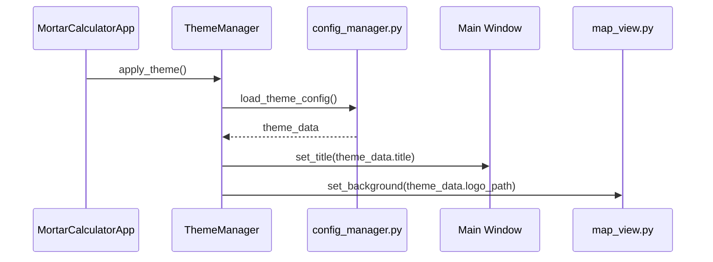

# **Arma Reforger Mortar Calculator v1.2.0 Improvement Plan**

## **1. Project Goals**

This document outlines the plan for version 1.2.0 of the Arma Reforger Mortar Calculator. The primary objectives for this release are:

*   **Enhance User-Friendliness & Practicality:** Streamline the user interface and workflow to make the tool more intuitive and efficient for in-game use.
*   **Introduce Custom Theming:** Implement a system that allows users to apply custom branding, including a personalized title and background logo.

## **2. Analysis of Current System**

The application is built with Python's Tkinter library and is structured into several key components:

*   [`main.py`](../../ArmaReforgerMortarCalculatorApp/main.py:58): The main application class that manages the UI and application state.
*   [`ui/map_view.py`](../../ArmaReforgerMortarCalculatorApp/ui/map_view.py:5): A widget for displaying the map, and plotting mortar, FO, and target positions.
*   [`ui/settings_view.py`](../../ArmaReforgerMortarCalculatorApp/ui/settings_view.py:4): A view for managing maps and application settings.
*   [`config/config_manager.py`](../../ArmaReforgerMortarCalculatorApp/config/config_manager.py:7): A class for handling map configurations.
*   `calculations.py`: Contains the core ballistic calculation logic.

The current UI, while functional, is dense with input fields, which can be overwhelming. The workflow requires significant manual data entry, and the theming is limited to a basic dark/light mode toggle.

## **3. Proposed Enhancements**

### **3.1. User-Friendliness & Practicality**

To improve the user experience, I propose the following changes:

#### **3.1.1. UI Redesign: A More Guided Workflow (Shelved)**

This proposed UI redesign has been shelved for v1.2.0 to prioritize other features. The existing single-form layout will be retained.

#### **3.1.2. Streamlined Fire Mission Corrections**

The fire mission correction workflow will be improved. After a shot is fired, the user can input the observed deviation, and the calculator will automatically suggest the necessary adjustments for the next shot.

### **3.2. Custom Theming & Branding**

A new theming system will be introduced, allowing users to customize the application's appearance.

#### **3.2.1. Theme Configuration**

The [`config/config_manager.py`](../../ArmaReforgerMortarCalculatorApp/config/config_manager.py:1) will be extended to manage a new `theme_config.json` file. This file will store settings for:

*   **Custom Title:** A user-defined title for the application window.
*   **Logo/Background Image:** A path to an image file to be displayed as a watermark or background in the application.
*   **Color Palette (Optional):** Advanced users could specify custom colors for UI elements.

Here is an example of the proposed `theme_config.json`:

```json
{
  "title": "My Milsim's Mortar Calculator",
  "logo_path": "path/to/my/logo.png",
  "use_logo_as_background": true
}
```

#### **3.2.2. Theming System Architecture**

The following diagram illustrates how the theming system will work:



The new `ThemeManager` class will be responsible for loading the theme configuration and applying it to the various UI components.

### **3.3. Battle Plan Feature**

*   **New "Battle Plan" Tab:**
    *   A new tab will be added to the main notebook, positioned between the "Main" and "Settings" tabs.
    *   This tab will house the entire "Battle Plan" feature.

*   **Image Upload:**
    *   A button within the "Battle Plan" tab will allow users to upload an image of the AO.
    *   The image will be displayed in a dedicated canvas within the tab.

*   **Drawing Tools:**
    *   A simple toolbar will be provided with basic drawing tools (line, arrow, circle, rectangle, text) and color selection.

*   **Saving and Loading:**
    *   Users will be able to save and load their battle plans, including the base image and all tactical overlays.

```mermaid
graph TD
    A[Start Application] --> B[Select "Battle Plan" Tab];
    B --> C{Upload AO Screenshot};
    C -- Yes --> D[Display Image in Canvas];
    D --> E[Use Drawing Tools to Create Plan];
    E --> F{Save Battle Plan?};
    F -- Yes --> G[Save Plan to File];
    F -- No --> H[Continue];
    B --> I{Load Existing Battle Plan?};
    I -- Yes --> J[Load Plan from File];
    J --> D;
```

## **4. Implementation Plan**

I will break down the development into the following phases:

1.  **Phase 1: UI Redesign**
    *   Restructure the main UI into a guided, multi-step workflow.

2.  **Phase 2: Theming System**
    *   Extend the [`config/config_manager.py`](../../ArmaReforgerMortarCalculatorApp/config/config_manager.py:1) to handle `theme_config.json`.
    *   Create the `ThemeManager` class to apply themes.
    *   Modify the UI to support custom titles and background images.

3.  **Phase 3: Refinement & Testing**
    *   Refine the fire mission correction workflow.
    *   Thoroughly test all new features and improvements.

### **3.4. Quality of Life Improvements**

*   **Keyboard Shortcuts:**
    *   `Ctrl+Enter`: Calculate Firing Solution
    *   `Ctrl+N`: New Mission (clear all input fields)
    *   `Ctrl+L`: Load Mission from file

*   **Enhanced Mission Log:**
    *   Add optional "FO ID" and "Mortar Callsign" fields to the UI.
    *   These fields will be saved with the mission data and displayed in the mission log.
    *   If left blank, they will be saved as empty strings.